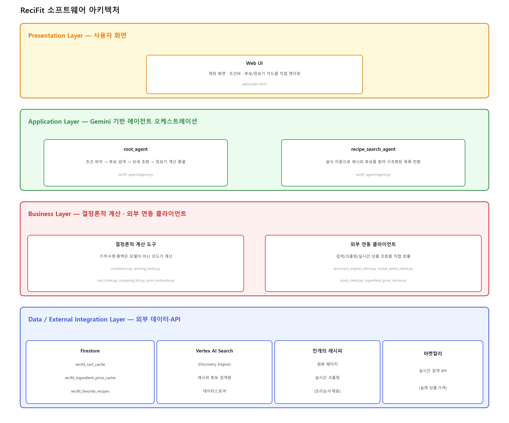

<div align="center">

# 🍳 ReciFit

### 예산에 맞춰 레시피를 추천하고, 실제 장보기 목록까지 만들어주는 AI 에이전트

[](https://recifit-812799679771.us-central1.run.app)
[]()
[]()
[]()

**[🔗 지금 써보기](https://recifit-812799679771.us-central1.run.app)**

</div>

---

## 목차

- [서비스 소개](#서비스-소개)
- [아키텍처](#아키텍처-한눈에-보기)
- [설치 및 실행](#설치)
- [배포](#배포)
- [한계](#한계)

---

## 서비스 소개

> 사용자가 "3만원 이내로 1인 20대 남자가 먹을만한 닭 요리 추천해줘, 갑각류 알레르기가 있어서
> 빼줘"처럼 자연어로 요청하면, 조건에 맞는 레시피 후보를 먼저 보여주고 → 하나를 고르면
> 조리법과 실제 마켓컬리 상품·가격까지 계산해 장보기 목록을 만들어준다.

| 구분 | 내용 |
|---|---|
| **Target** | 예산·인원수를 고려해 매번 장보기 계산을 직접 하기 귀찮은 1인·소가구 자취생/직장인 |
| **Problem** | 레시피는 많지만 "내 예산·인원수·알레르기에 맞는 실제 구매 목록"까지 계산해주는 서비스는 없음 |
| **Solution** | 조건 파악 → 레시피 후보 추천 → 실시간 마켓컬리 검색으로 최저가 상품 매칭 → 총액·예산 이내 여부까지 한 번에 |

### 핵심 기능

- **조건 기반 레시피 추천** — 예산·가구 인원수·알레르기/제외 재료·보유 재료·몇 끼 분량인지를
  자연어에서 파악해 후보 목록에 반영한다(알레르기 재료가 든 레시피, "매운 거 싫어" 같은 취향에
  안 맞는 레시피는 후보에서부터 제외).
- **참고가격 → 정확한 가격 2단계 흐름** — 후보를 볼 때는 캐시 기반 참고가격으로 빠르게, 하나를
  고른 뒤에는 마켓컬리 실시간 검색으로 정확한 가격을 계산한다.
- **결정론적 계산** — 가격·수량·총액 등 최종 숫자는 모델이 만들어내지 않고 전부 코드
  (`cart_tools.py`, `shopping_list.py`, `price_estimate.py`)가 계산한다.
- **즐겨찾기** — 조건과 장보기 결과를 저장해두고 다시 꺼내볼 수 있다.

---

## 아키텍처 한눈에 보기

<p align="center">
  
</p>

- **Web UI** (`web/index.html`) — 정적 HTML/CSS/JS 채팅 화면. ADK `/run_sse`를 직접 호출하고,
  각 도구(`get_recipe`, `record_conditions`, `build_shopping_list`)의 구조화된 응답을 화면에
  직접 렌더링한다(모델이 옮겨 적은 텍스트를 신뢰하지 않음).
- **Backend** (`server.py`) — `google-adk`의 FastAPI 앱에 `/favorites/*`, `/favorite-recipes*`
  커스텀 라우트를 추가한 커스텀 엔트리포인트.
- **root_agent** (`recifit_agent/agent.py`) — 사용자 요청을 해석해 조건을 파악하고, 레시피
  검색([A]단계, `recipe_search_agent`) → 선택 → 상세 조회(`get_recipe`) → 장보기
  계산([B-2]단계, `build_shopping_list`)까지 흐름을 총괄하는 오케스트레이터.
- **레시피 검색** — Vertex AI Search(Discovery Engine) 데이터스토어를 `discovery_engine_client.py`로
  직접 호출(recipe_id 등 구조화 필드를 그대로 사용하기 위해 `VertexAiSearchTool` 대신 사용).
- **레시피 상세** — `recipe_detail_client.py`가 만개의 레시피 원본 페이지를 실시간 크롤링.
- **상품/가격** — `kurly_client.py`가 마켓컬리 실시간 검색 API를 직접 호출.
- **가격 캐시** — `ingredient_price_cache.py`가 실제 검색된 상품 가격을 Firestore
  (`recifit_ingredient_price_cache`)에 누적해두고, `price_estimate.py`(`estimate_recipe_price`)가
  이를 조회해 [A]단계 참고가격을 실시간 검색 없이 빠르게 계산한다.
- **Firestore** — `recifit_cart_cache`(장보기 결과 캐시), `recifit_ingredient_price_cache`
  (재료 단위가격 캐시), `recifit_favorite_recipes`(즐겨찾기) 세 컬렉션 사용.

### 핵심 기술 스택

| 영역 | 기술 | 선정 이유 |
|---|---|---|
| Agent | Google ADK, Gemini 2.5 Flash | 도구 호출 기반 오케스트레이션과 구조화 출력(`output_schema`)을 표준으로 지원 |
| 검색 | Vertex AI Search (Discovery Engine) | 레시피 데이터를 RAG로 검색하면서 문서 ID 등 구조화 필드를 그대로 받아올 수 있음 |
| DB | Firestore | 가격 캐시·즐겨찾기처럼 스키마가 자주 바뀌는 소규모 문서 저장에 적합, 서버리스라 운영 부담 적음 |
| Infra | Cloud Run, Docker | 트래픽에 따라 자동 스케일되고, 컨테이너 하나로 백엔드+프론트를 함께 배포 가능 |

---

## 설치

```bash
pip install -r requirements.txt
```

`pyproject.toml`에 `pythonpath = ["."]`가 설정돼 있어 저장소 루트에서 바로 `pytest`/스크립트를
실행할 수 있다.

## 환경 변수

`recifit_agent/.env.example`을 복사해 `recifit_agent/.env`를 만들고 채운다:

| 변수 | 설명 |
|---|---|
| `GOOGLE_GENAI_USE_VERTEXAI` | `1`로 고정 (Vertex AI 경유 Gemini 사용) |
| `GOOGLE_CLOUD_PROJECT` | GCP 프로젝트 ID |
| `GOOGLE_CLOUD_LOCATION` | Gemini 리전 (예: `us-central1`) |
| `MODEL` | 사용할 Gemini 모델 (기본 `gemini-2.5-flash`) |
| `DISCOVERY_ENGINE_LOCATION` | 레시피 데이터스토어 리전 (GENERIC 검색앱은 보통 `global`) |
| `RECIPES_DATA_STORE_ID` | 레시피 Vertex AI Search 데이터스토어 ID |

로컬에서는 `gcloud auth application-default login`으로 GCP 인증을 해둬야 Vertex AI
Search/Firestore/Gemini 호출이 된다.

## 로컬 실행

```bash
python server.py            # 기본 127.0.0.1:8000, HOST/PORT 환경변수로 조정 가능
```

`server.py`는 ADK 표준 API(`/run`, `/run_sse`, 세션 엔드포인트)와 커스텀 `/favorites/*`,
`/favorite-recipes*` 엔드포인트를 함께 띄우고, `web/` 정적 파일도 같은 서비스에서 서빙한다.
브라우저로 `http://127.0.0.1:8000`을 열면 바로 채팅 UI가 뜬다.

## 테스트

```bash
pytest
```

`tests/`에 `cart_tools`, `ingredient_parser`, `kurly_client`, `shopping_list`,
`ingredient_price_cache`, `price_estimate` 단위 테스트가 있다(총 34개). 재료 단위가격 캐시나
Firestore를 직접 호출하는 부분은 실제 네트워크 호출 없이 monkeypatch로 검증한다.

## 재료 단위가격 캐시 시딩/갱신

`estimate_recipe_price`([A]단계 참고가격)는 실시간 검색을 하지 않고 캐시만 조회하므로, 배포
초기에는 캐시가 비어 있다. 아래 스크립트로 채우거나 갱신한다:

```bash
python scripts/seed_ingredient_price_cache.py             # 흔한 재료 ~58개 부트스트랩 시딩
python scripts/seed_ingredient_price_cache.py --refresh   # 이미 캐시된 재료 전체를 실시간 재검색해 갱신
```

## 배포

```bash
gcloud run deploy recifit --source . --region us-central1 \
  --allow-unauthenticated --max-instances=1
```

`Dockerfile`(`python:3.12-slim`, `requirements.txt` 설치 후 `python server.py` 실행) 기반으로
빌드된다. `recifit_agent/.env`는 `.dockerignore`로 이미지에서 제외되며, 실행에 필요한 환경
변수는 Cloud Run 서비스 설정에서 별도로 주입한다. 세션이 로컬 파일 기반이라 인스턴스 간
상태가 어긋날 수 있어 `--max-instances=1`로 제한한다(세션을 외부 저장소로 옮기는 건 후반기
과제).

## 한계

- 마켓컬리 검색/만개의 레시피 크롤링은 비공식 연동이라 응답 구조가 바뀌면 깨질 수 있다.
- [A]단계 참고가격은 캐시가 없는 재료를 모델이 어림잡는 방식이라, 레시피에 따라 [B-2] 실제
  총액과 여전히 크게 벌어질 수 있다.
